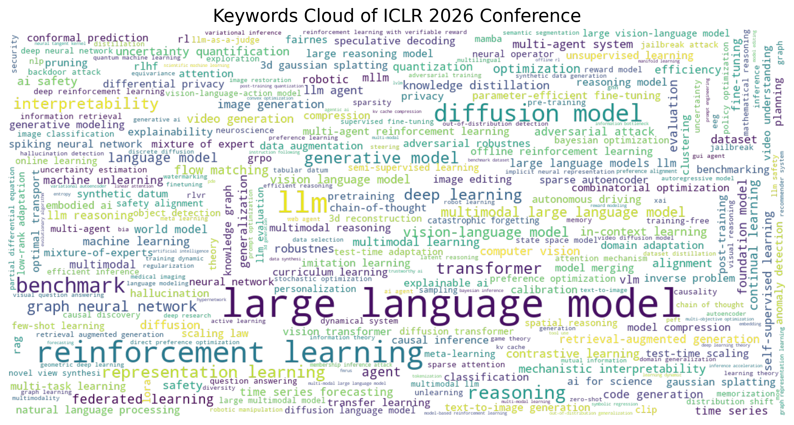
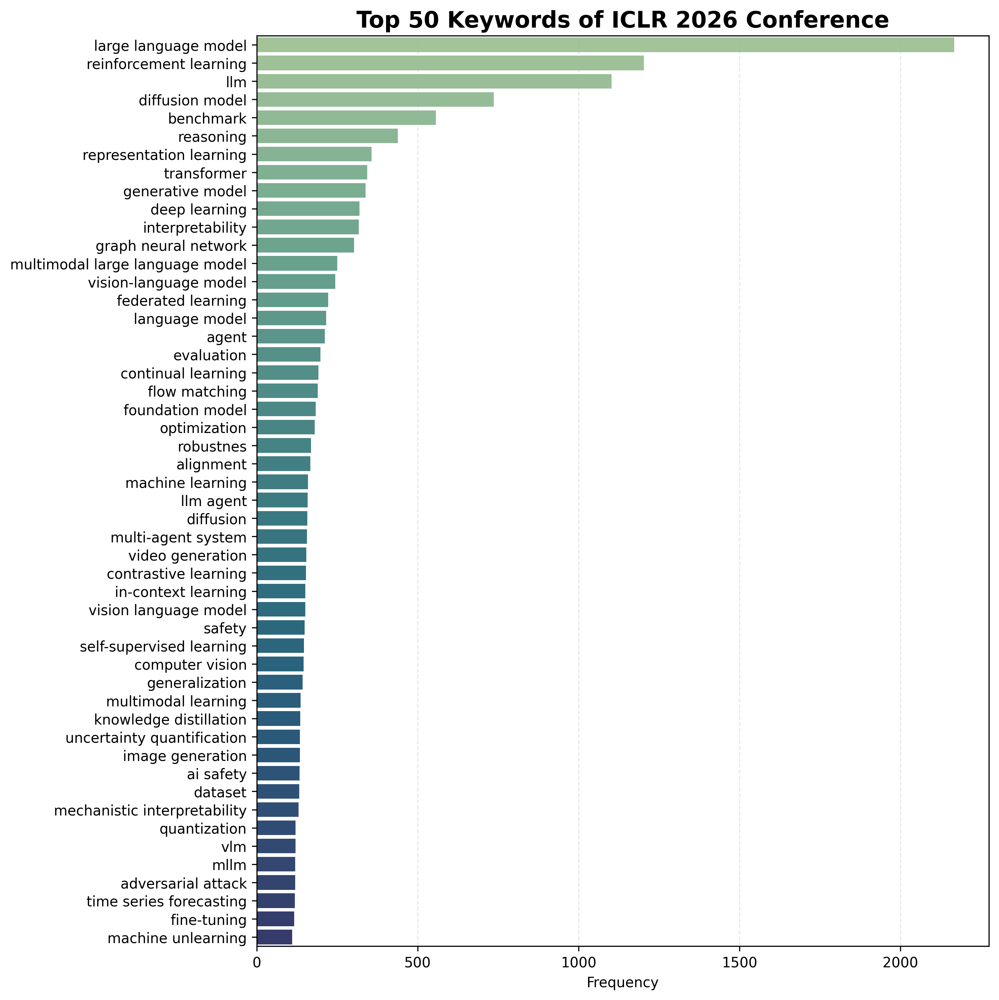

# OpenReview Fetcher

**OpenReview Fetcher** is a lightweight command-line tool for collecting and analyzing conference submission data from **OpenReview.net**.
It currently supports the **ICLR conference** and enables rapid insight generation through automated keyword extraction, visualization, and statistical summaries.

---

## Installation

You can download the latest version of **OpenReview Fetcher** directly from the Fresh repository:

🔗 **[openreview_fetcher.py — View on GitHub](https://github.com/Yangs-AI/Fresh/blob/main/Tools/Fetchers/openreview_fetcher.py)**

Or fetch it via command line:

:::tip
* A. Clone the entire Fresh repo
```bash
git clone https://github.com/Yangs-AI/Fresh.git
cd Fresh/Tools/Fetchers
```
* B. Or download only this script
```bash
curl -O https://raw.githubusercontent.com/Yangs-AI/Fresh/main/Tools/Fetchers/openreview_fetcher.py
```
:::

Then install the required Python dependencies:

```bash
pip install tqdm click numpy pandas seaborn textblob wordcloud openreview-py bokeh
python -m textblob.download_corpora
```

Once installed, you can directly run the fetcher from your working directory.

---

## Usage

### Command-Line Overview
The entry point of **OpenReview Fetcher** supports multiple subcommands.  
You can view global options and available tasks by running:

```bash
python openreview_fetcher.py --help
```

**Global Options**

| Option | Description |
|---------|--------------|
| `--username` | Your OpenReview account username |
| `--password` | Your OpenReview account password |
| `--help` | Show help message and exit |

**Available Commands**
| Command | Description |
|---------|--------------|
| `iclr` | Fetch and analyze data from the ICLR conference |

---

### ICLR Subcommand
Fetch data for the ICLR 2026 conference and visualize its keyword landscape:

```bash
python openreview_fetcher.py iclr \
    --year 2026 \
    --topk 50 \
    --output-dirpath /path/to/your/working/dir \
    --online
```

**Subcommand Options**
| Option | Description |
|---------|--------------|
| `--year` | Year of the ICLR conference *(required)* |
| `--topk` | Number of top keywords to analyze *(required)* |
| `--output-dirpath` | Directory path for saving fetched data *(required)* |
| `--online` | Launch interactive HTML view in browser |
| `--refetch` | Force refetching of submission data |
| `--help` | Show help message and exit |

---

## Example: Results Preview

Below are visual analytics automatically generated for **ICLR 2026 submissions**:

### Keyword Cloud 🧩
Visualizes the diversity and relative prominence of research topics.



---

### Top-50 Keywords 📈
Highlights the most frequent terms in submission metadata.



---

### Interactive Dashboard 🌐
An interactive HTML dashboard provides filtering, sorting, and keyword-specific exploration.
Open it directly in your browser to explore relationships between **abstracts**, **authors**, and **submission fields**.

{/* [Open the Dashboard (ICLR 2026)](./ios/ICLR-2026-Submissions-Online.html) */}
```mdx-code-block
import HTMLViewer from '@site/src/components/Miscs/HTMLViewer';
import DashboardURL from './ios/ICLR-2026-Submissions-Online.html';

<HTMLViewer src={DashboardURL} height={920} title="ICLR 2026 Dashboard" />
```

### Fetched CSV 🧾

**[ICLR-2026-Submissions.csv](./ios/ICLR-2026-Submissions.csv)**

This CSV file contains the **complete metadata** of all ICLR 2026 submissions retrieved from OpenReview, including **paper titles, authors, affiliations, keywords**, and other public information.

It serves as the **raw data foundation** for generating visual analytics such as the keyword cloud, top-50 frequency chart, and interactive dashboard.

Researchers can reuse this file to perform **custom analyses**, for example: keyword co-occurrence networks, topic evolution studies, or cross-year comparisons across ICLR conferences.

---

## Input/Output Format

When executed, the fetcher need no input data, and itproduces:

| File | Description |
|------|--------------|
| `ICLR-{year}-Submissions.csv` | Raw metadata of all ICLR 2026 submissions (title, keywords, authors, etc.) |
| `ICLR-{year}-Submissions-Keyword-Cloud.png` | Word cloud visualization of keywords |
| `ICLR-{year}-Submissions-Keyword-Top-50.png` | Bar chart showing top-50 keywords |
| `ICLR-{year}-Submissions-Online.html` | Interactive visualization dashboard |

---

## Insight 💡

These analytics illustrate the evolving **research focus of the AI(ICLR) community**.
In 2026, dominant themes include:

Such analysis helps track emerging paradigms and anticipate future research frontiers.

Beyond topical trends, we also analyze **abstract length** and **submission volume** across research areas.
This enables a preliminary understanding of each field's **competitiveness** and **stylistic tendencies** in abstract writing.
Although this version only accounts for abstract length, the results already hint at characteristic differences between domains.

---

## Roadmap 🔭

Future versions of *OpenReview Fetcher* will extend support to additional conferences (e.g., NeurIPS, ICML, ACL) and integrate semantic clustering for deeper topic modeling.
