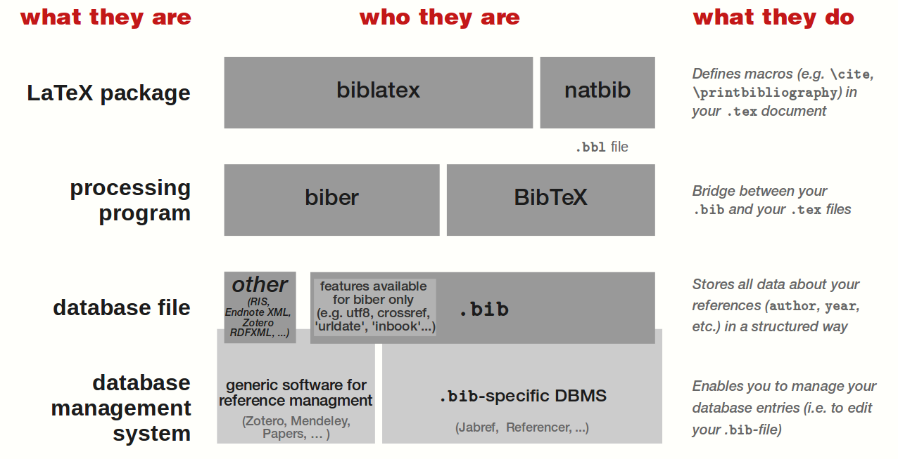

**Zotero** is the recommended reference management tool in our research workflow. It supports automatic citation formatting, full-text indexing, and collaborative literature sharing across teams. This tutorial focuses on installing and configuring Zotero, with particular emphasis on plugin setup and group library management. Since Zotero's built-in cloud storage is limited, we also provide instructions for integrating Zotero with external cloud storage services such as OneDrive.

Zotero (/zoʊˈtɛroʊ/) is a free and open-source reference management software used to manage bibliographic data and related research materials such as PDF and ePUB files. Its features include browser integration, online synchronization, in-text citations, footnotes and bibliographies, integrated PDF/ePUB/HTML readers with annotation support, and a built-in note editor. Zotero integrates with Microsoft Word, LibreOffice Writer, OnlyOffice, and Google Docs. Originally developed by the Center for History and New Media at George Mason University, Zotero has been maintained since 2021 by the non-profit Corporation for Digital Scholarship. (Source: Wikipedia - https://en.wikipedia.org/wiki/Zotero)

---

### Overview

This setup guide will help you:

- Install Zotero and essential plugins.
- Synchronize your library across devices (optionally via OneDrive or other cloud services).
- Collaborate efficiently using Zotero Groups.

---

### Step 1: Install Zotero and Plugins

#### Installing Zotero

Download and install the latest version of **[Zotero](https://www.zotero.org/download/)**, and follow the instructions to install the browser connector. Once installed, you can save references directly to your personal or group library by clicking the browser connector while browsing academic resources online.

Within Zotero, you can organize references into different **collections** according to your needs. A single reference only needs to be added once to the library, but it can appear in multiple collections (internally stored once, with multiple logical references).

#### Installing Zotero Plugins

Zotero officially supports a wide range of plugins, listed at:
https://www.zotero.org/support/plugins

In this guide, we focus on two high-frequency plugins: one for citation export and one for PDF translation.

1. **[Better BibTeX for Zotero](https://retorque.re/zotero-better-bibtex/)**  
   Enables automatic citation key generation and seamless BibTeX/BibLaTeX export for LaTeX users.

2. **[Zotero PDF Translate](https://github.com/windingwind/zotero-pdf-translate)**  
   Provides instant translation of selected text within PDFs.

To install these plugins, open Zotero and navigate to **Tools → Plugins**, then download the corresponding `.xpi` files from the plugin websites and drag them into the `Plugin Manager` window.

Restart Zotero after installation.

---

### Configuration

All software and plugin settings can be found under **Edit → Settings**, which opens the `Zotero Settings` window. All tabs and options mentioned below refer to this interface.

Only key recommended settings are described here; other options may be adjusted according to personal preferences.

#### Software Settings

1. In the **General** tab, you may change the default tools used to open PDFs/EPUBs/Snapshots. Zotero is used by default.
2. It is recommended to enable cloud synchronization. In the **Sync** tab, register or log in with your Zotero account. By default, Zotero syncs both metadata and attachment files. Since free accounts have limited storage, we strongly recommend **disabling attachment file syncing to Zotero's cloud** and instead using an external cloud service (see Step 2).

#### Plugin Settings

##### Better BibTeX for Zotero

1. In the **Export** tab, set **Item Format** to **Better BibTeX** or **Better BibLaTeX**.

   **Background knowledge:** What are *BibTeX* and *BibLaTeX*?  
   What is the relationship between `bibtex` vs. `biber`, and `biblatex` vs. `natbib`?

   These terms refer to different but closely related components in the LaTeX bibliography ecosystem, including bibliography formats, citation packages, and backend processors.  
   They are often confused because they are frequently used together but serve distinct roles.

   The figure below provides a concise overview of how these components relate to one another.  
   
   For a detailed explanation, see this StackExchange discussion:  
   https://tex.stackexchange.com/questions/25701/bibtex-vs-biber-and-biblatex-vs-natbib


   **How to choose:**

   - If you are writing papers using traditional BibTeX-based templates (e.g., IEEE, ACM, NeurIPS, ICML, ICLR) with `.bst` style files, choose **Better BibTeX**. This is the most compatible and widely used option in computer science and engineering, and works reliably with Overleaf and journal submission systems.
   - If you are using modern templates that explicitly rely on `biblatex` (e.g., Springer LNCS, Elsevier, Nature, or thesis templates), choose **Better BibLaTeX**, which supports richer metadata such as `url`, `urldate`, and `eprint`.

   **In short:**
   - *Better BibTeX* → Stable, general-purpose, recommended for most CS conferences and journals.
   - *Better BibLaTeX* → More expressive, suitable for modern or interdisciplinary templates.

   **Recommendation:** For team collaboration and shared libraries, standardize on **Better BibTeX** to avoid compatibility issues.

2. Under **Citation Keys**, set the citation key formula to:
   ```
   auth.lower + year + shorttitle(3, 3).lower
   ```
   This is the format currently adopted by our group. Advanced customization options can be found in the official documentation:
   https://retorque.re/zotero-better-bibtex/citing/index.html

3. Under **Export**:

   - **BibTeX section**:
     - Enable *Export unicode as plain-text LaTeX commands*.
     - Set *Add URLs to BibTeX export* to:
       ```
       in the 'url' field
       ```

   - **BibLaTeX section**:
     - Enable *Use BibLaTeX extended name format* (only if compiling with `biblatex/biber`).
     - Enable *add use-prefix when family name has a prefix*.

   - **Fields**:
     - In *Fields to omit from export*, enter:
       ```
       file,eprint,eprinttype,eprintclass,abstract
       ```
     - Set *Export language as* to `langid`.
     - Set *When item has DOI and URL* to `both`.

   - **Miscellaneous**:
     - Do **not** enable *Automatically abbreviate journal title if none is set explicitly*.
     - Enable *Apply title-casing to titles* only if required by the target venue.

##### Zotero PDF Translate

Open the **Translate** tab and configure as follows:

1. **General**:
   - Enable *Automatically Translate Selection*.
   - Do **not** enable *Automatically Translate Annotation*, as it replaces original annotations with translations.
2. **Service**:
   - Set *Translation Service* to **Google (API)**.
   - Configure *Translate From* according to your needs.
   - Set *Dictionary Service* to **Collins Dict (en→zh)** or **FreeDictionaryAPI (en→en)**.
3. Keep other options at their default values unless specific customization is required.

---

### Step 2: Configure Cloud Storage (Optional)

Zotero's built-in cloud storage is limited, and attachment files (PDFs, snapshots) consume most of the space, while metadata itself is lightweight. To avoid storage limits and keep attachments synchronized across devices, we recommend using an external cloud service such as OneDrive.

Example using OneDrive (other services follow similar logic):

1. Open **Settings → Sync**, and disable both:
   - *Sync attachment files in My Library using Zotero storage*
   - *Sync attachment files in group libraries using Zotero storage*
2. Move Zotero's `storage` directory to a folder within OneDrive (e.g., `C:\Users\Fresher\OneDrive\Zotero`).  
   If another device is already synced, skip this step, close Zotero, delete the local `storage` folder, and proceed to the next step.
3. Create a directory junction (Windows example; use equivalent symlink commands on macOS/Linux):

   ```powershell
   mklink /J "C:\Programs\Zotero\storage" "C:\Users\Fresher\OneDrive\Zotero\storage"
   ```
   or
   ```bash
   ln -s /path/to/your/OneDrive/Zotero/storage /path/to/your/Programs/Zotero/storage
   ```

After this, all attachments and notes will remain synchronized across devices.

---

### Step 3: Quickly Add References

Install the **Zotero Connector** browser extension from:
https://www.zotero.org/download/

When browsing academic websites, the connector captures metadata, PDFs, and snapshots and saves them to Zotero.

To ensure references are saved into the correct collection:

1. Select the target collection in the connector popup when saving; or
2. Select the desired collection in Zotero first, keep it active, then click the connector in your browser.

Note: Please ensure you access the correct paper via the correct DOI link.

---

### Step 4: Join the Group Library

For collaborative citation sharing (It is recommended to configure Cloud Storage before this step.):

1. Provide your Zotero account username or registered email to your advisor or group administrator.
2. Once invited, you will see the shared **Group Libraries** in the left panel.
3. Add papers you have read or found useful to the Group Library, ensuring accurate metadata and appropriate tags.

The shared library accelerates citation reuse and preserves the collective research memory of the team.

---

### Summary

Zotero, combined with Better BibTeX and PDF Translate, forms a **lab-standard literature environment** that is reproducible, searchable, and collaboration-friendly.

With optional OneDrive synchronization and shared Group Libraries, every team member contributes to a continuously evolving citation ecosystem.